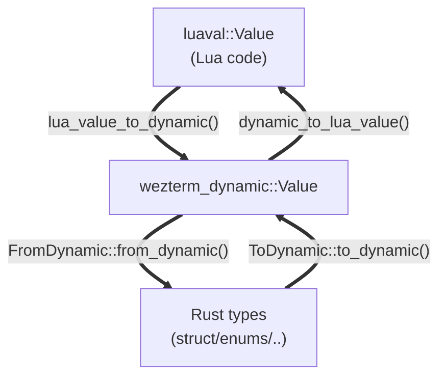

# wezterm-dynamic

A purpose-built serialization/deserialization layer for WezTerm's configuration system.
It defines a Lua-like intermediate value representation (`Value`) and provides
bidirectional conversion between that representation and Rust types via two derivable traits:
- `ToDynamic`
- `FromDynamic`

It exists because WezTerm's config is driven by Lua scripts, and a dedicated intermediate layer
between Lua table <-> Rust struct allows for richer error messages and WezTerm-specific conversions.

The data flow is:


`wezterm_dynamic::Value` is the stable intermediate representation that decouples `mlua` from all Rust config/domain types.

## The `Value` type

The central type is an owned, lifetime-free enum:
```rust
pub enum Value {
    Null,
    Bool(bool),
    String(String),
    U64(u64),
    I64(i64),
    F64(OrderedFloat<f64>),
    Array(Array),   // newtype over `Vec<Value>`
    Object(Object), // newtype over `BTreeMap<Value, Value>`
}
```
It is intended to be convertible to the same set of types as Lua.

Numeric coercion methods are available to allow cross-numeric-type reads during deserialization.

## The `ToDynamic` and `FromDynamic` traits

These are the primary traits for converting between Rust types and `Value`.
Blanket implementations are provided for all commonly used Rust types; for custom types, both are derivable.

```rust
pub trait ToDynamic {
    fn to_dynamic(&self) -> Value;
}

pub trait FromDynamic: Sized {
    fn from_dynamic(value: &Value, options: FromDynamicOptions) -> Result<Self, Error>;
}
```

Both are derivable for named-field structs and all non-generic enums.
Tuple structs, unions, and generic enums are rejected at compile time.

Example usage:
```rust
#[derive(ToDynamic, FromDynamic)]
struct FontConfig {
    pub family: String,
    #[dynamic(default)]
    pub weight: FontWeight,
    #[dynamic(rename = "size_pts")]
    pub size: f64,
}
```

Deriving `FromDynamic` on a struct also generates a `possible_field_names()` associated
function, used to produce "did you mean X?" suggestions in error messages.

## `#[dynamic(...)]` attributes

Attributes are placed on struct/enum definitions or individual fields.

### Container-level (struct or enum)

| Attribute | Effect |
|---|---|
| `#[dynamic(debug)]` | Print the generated token stream to stderr at compile time |
| `#[dynamic(try_from = "OtherType")]` | Deserialize into `OtherType` then construct `Self` via `TryFrom<OtherType>` |
| `#[dynamic(into = "OtherType")]` | Convert `self` into `OtherType` via `Into`, then serialize `OtherType` |

### Field-level

| Attribute | Effect |
|---|---|
| `#[dynamic(skip)]` | Exclude field from serialization; use `Default::default()` on field deserialization |
| `#[dynamic(flatten)]` | Inline this field's struct keys into the current object |
| `#[dynamic(rename = "name")]` | Use a different key in the dynamic/Lua representation |
| `#[dynamic(default)]` | Use `Default::default()` when the field is absent |
| `#[dynamic(default = "fn_path")]` | Call a named function when the field is absent |
| `#[dynamic(deprecated = "reason")]` | Emit a warning (or error) when this field is encountered during deserialization |
| `#[dynamic(validate = "fn_path")]` | Validate field using a validator function after deserialization; must return `Result<(), String>` |
| `#[dynamic(try_from = "OtherType")]` | Deserialize into `OtherType` then construct field type via `TryFrom<OtherType>` |
| `#[dynamic(into = "OtherType")]` | Convert field into `OtherType` via `Into`, then serialize `OtherType` |

